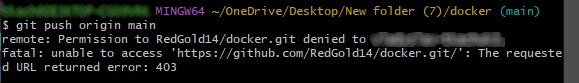

# git

### initialize repository
### configure repository
### begin file tracking
### stop file tracking
### stage changes
### commit changes
### setup .gitignore

- Branching

-----------------------------------------------------------------------

Error: git push origin. The requested URL returned error: 403

Solution: change url from HTTPS to SSH

